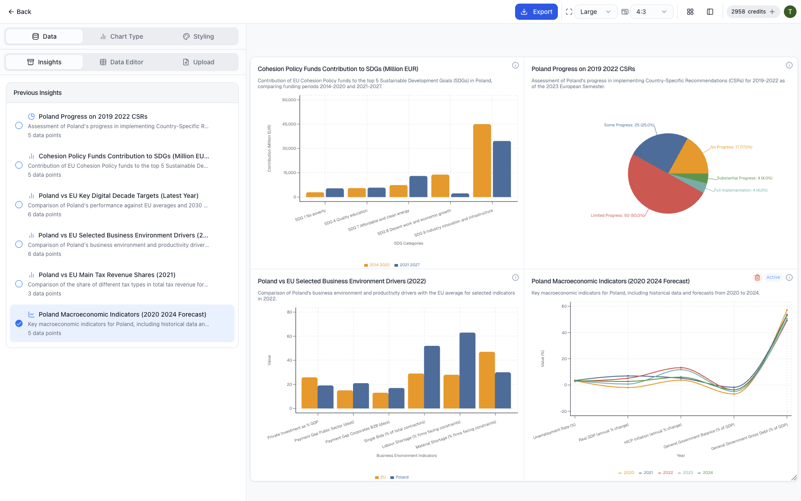

# ChartWeaver AI

Transform your data storytelling with ChartWeaverAI — where artificial intelligence meets beautiful data visualization.

This project is a deep dive into the capabilities of AI-driven development. It was conceived as a personal challenge to see how far I could push modern developer tools to build a real, functional product, with AI acting as the primary developer under my guidance.

## Showcase

### 🎥 Demo Video

*Click the image above to watch the full demo video*

### 📊 Application Preview

  
  
<em>ChartWeaver AI in action - transforming Polish economic data into beautiful, interactive visualizations</em>

## About The Project

ChartWeaverAI is an intelligent data visualization tool that transforms raw data from various formats (Text, CSV, PDF) into interactive, beautiful charts. The platform uses AI to analyze complex data, extract key insights, recommend the best chart types, and provide a powerful editor for full customization.

### An Experiment in AI-Driven Development

This project was more than just building an application; it was an experiment to explore the new frontier of software engineering. The core philosophy was to act as an **AI Orchestrator** or **Guide**, rather than a traditional coder.

**Approximately 90% of the code** in this repository was written by AI, directed by my prompts and architectural decisions.

My goal was to challenge myself and answer the question: *How effectively can a solo developer build a complex, production-ready application by leveraging the full spectrum of AI tools available today?*

This involved a significant focus on developing a new set of skills beyond traditional programming.

## My Role as an AI Orchestrator: The Toolkit

Building this application required a specialized toolkit and a refined methodology for interacting with Large Language Models (LLMs).

### 1. Advanced Prompt Engineering

My primary role was translating product requirements into precise, context-rich prompts. This wasn't just asking for code; it was an iterative process of:

- Defining clear data structures and component APIs
- Providing stylistic guidelines and architectural constraints
- Debugging and refining AI-generated code through follow-up prompts
- Guiding the AI through complex logic step-by-step

### 2. AI-Native Development Environment (Cursor)

I used **Cursor**, an AI-first code editor, as my primary IDE. Its deep integration with models like Claude Sonnet 4 and GPT-5 allowed for a seamless workflow where I could generate, refactor, and debug code in-place without breaking my development flow.

### 3. LLM Evaluation and Testing

I experimented with various LLMs (including different versions of GPT, Claude, and Gemini) to understand their strengths and weaknesses for specific tasks like backend logic, UI generation, and data analysis.

### 4. Observability and Stability (LangSmith)

To ensure the reliability of the AI-powered analysis feature, I integrated **LangSmith**. This allowed me to:

- Trace the entire lifecycle of an LLM call, from user input to the final insight
- Analyze how prompts were performing and where the LLM might be failing or producing unstable results
- Debug complex chains and ensure the AI's responses were consistent and high-quality

### 5. Automated Prompt Testing (Promptfoo)

To systematically validate and improve the prompts powering the core analysis engine, I used **Promptfoo**. This enabled me to:

- Create a suite of test cases with various data inputs
- Run assertions to check if the AI's output (e.g., extracted data points, insights) was correctly structured and accurate
- Compare the performance of different prompts and models side-by-side to select the most effective ones

## Key Features of ChartWeaverAI

- **Multi-format Upload**: Import data from Text, CSV, and even multi-page PDF documents
- **AI-Powered Analysis**: Automatic pattern recognition, insight detection, and data extraction
- **Smart Visualization Suggestions**: AI recommends the best chart types for your specific data
- **Powerful Chart Creator**: Generate multiple chart types (Bar, Line, Pie, etc.) instantly
- **Interactive Dashboards**: Build multi-chart layouts (1x2, 2x2) to compare insights
- **Extensive Customization**: Full control over colors, backgrounds, axes, labels, and typography
- **Data Transparency**: Easily view the source data and page numbers used for each visualization
- **High-Resolution Export**: Download charts as PNG/JPG or export the structured data as a CSV

## Tech Stack

- **Frontend**: Next.js, React, Tailwind CSS, Recharts
- **Backend / API**: Next.js API Routes
- **AI & LLM Tooling**: LangChain.js, LangSmith, Promptfoo, Vercel AI SDK
- **Deployment**: Vercel

## Key Takeaways & Learnings

This project solidified my belief that the role of the developer is evolving. The future is less about writing boilerplate code and more about:

- High-level architecture and design
- Precisely articulating intent to an AI collaborator
- Validating, debugging, and integrating AI-generated outputs
- Using observability tools to ensure AI systems are reliable and performant

By embracing these tools, I was able to build ChartWeaverAI far more quickly and efficiently than would have been possible with traditional methods alone. It was a fantastic learning experience in prompt engineering, AI systems design, and the future of building software.